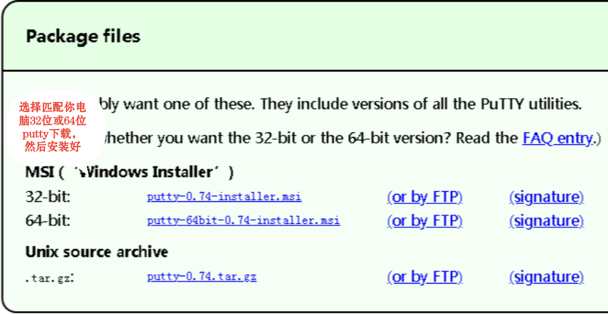
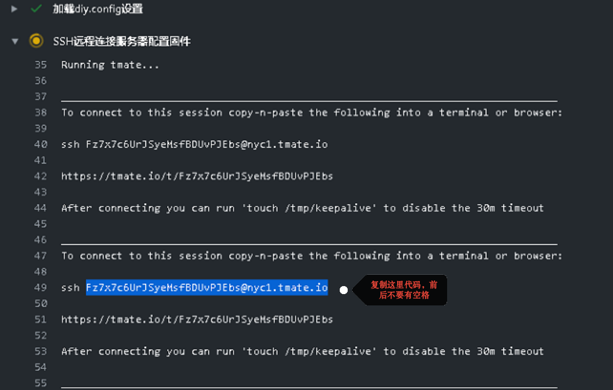
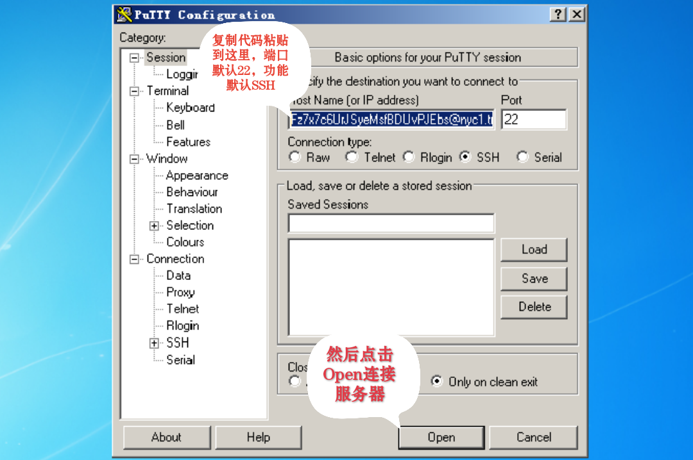
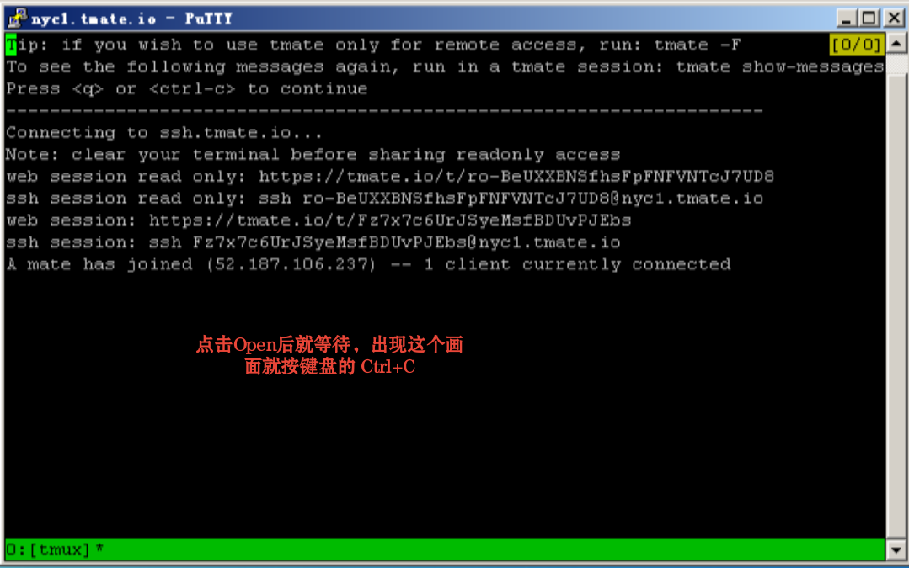
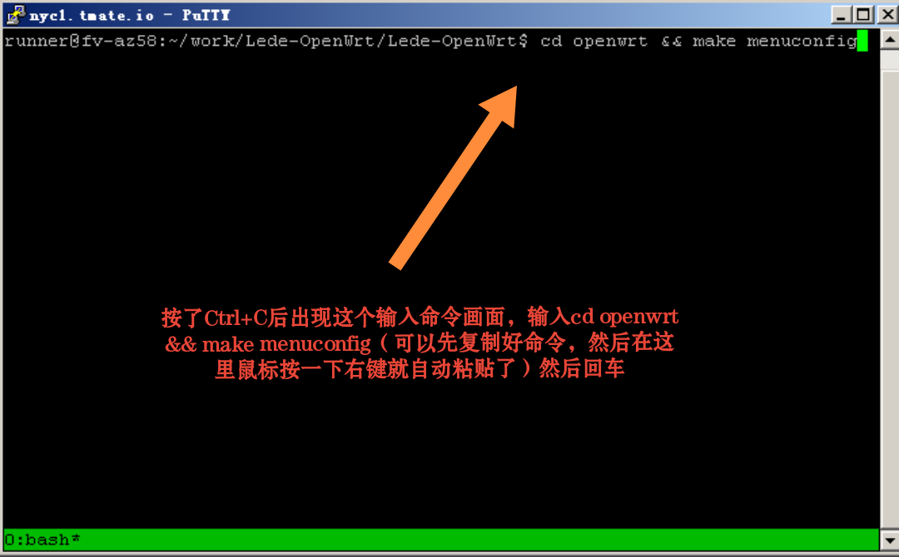
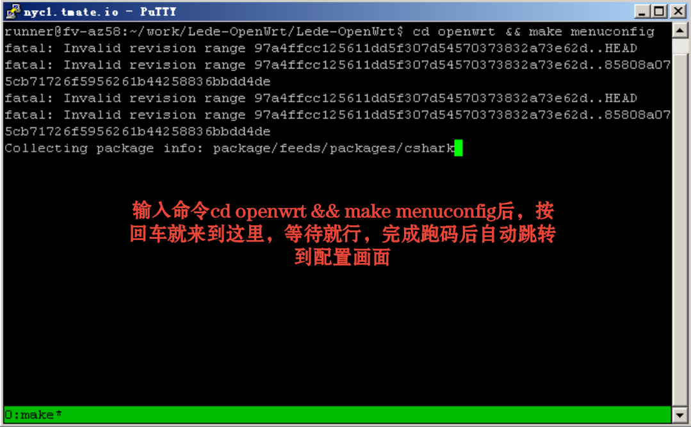
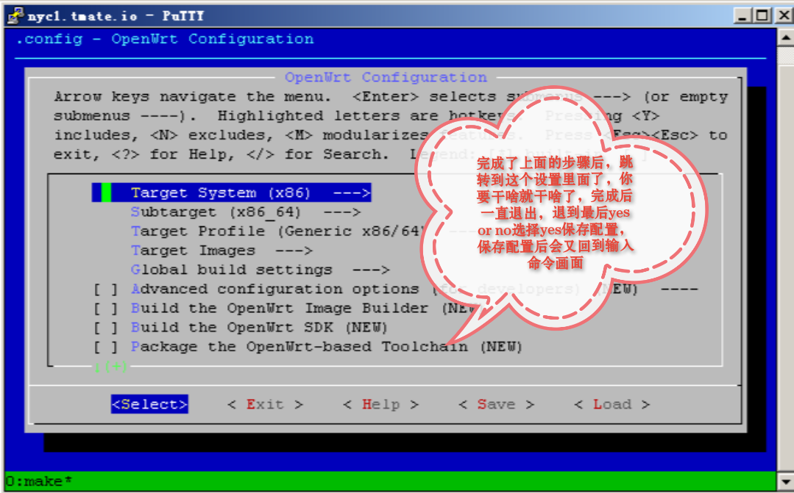
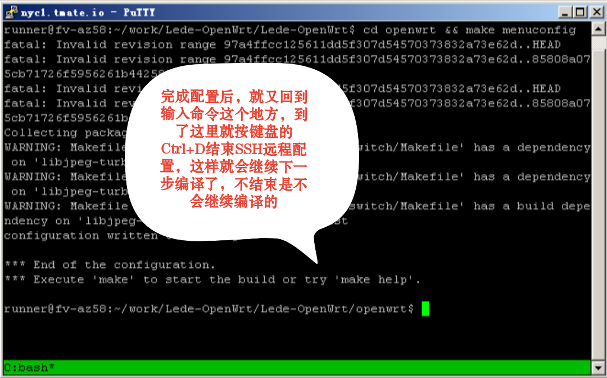

# 编译说明
- 注册一个github账号，然后你可以Fork我的脚本到你的仓库，按☆Star开始编译
- 开始后到 Actions 里面 点击 《lede-x86-64 固件》 ，然后再点击左上角的 《编译OpenWrt-lede固件》 就能查看编译情况了
- 等待编译开始然后到《SSH远程连接服务器配置固件》那里，然后用putty连接服务器修改你自己喜欢的配置或者机型（有时候你网络卡了，或者网页卡了，SSH会展不开的，就看不到连接代码，只能关闭编译重新再来）
- SSH连接简单说明：复制代码--粘贴到putty开始连接--等待跑码完成--按Ctrl+c--输入cd openwrt && make menuconfig然后回车--等待跑码完成进入配置画面（下面有图片说明）
- SSH连接进入定制界面后，不懂的可以这里看看《[软路由固件openwrt编译界面设置](https://www.youtube.com/watch?v=jEE_J6-4E3Y)》，youtube视频，需要梯子才能观看
- 进入定制界面后各种插件所对应的中文名字不懂的可以到这里《[添加插件应用说明](https://www.right.com.cn/forum/thread-3682029-1-1.html》参考下，这个是恩山大神xtwz整理的，更新比较老，有个别没有的，参考看吧
- 编译完成后，按 Actions 就能看到你编译完成的固件，点击一下就下载到你电脑了
- 虽然说用github云编译不需要梯子都可以，不过如果你要用到SSH连接的话，没有梯子是相当痛苦的，打开github网页也比较卡
- 此编译脚本来自[P3TERX大神一键编译脚本](https://github.com/P3TERX/Actions-OpenWrt)，感谢P3TERX大神！！！

# SSH工具下载
- 首先下载，安装好一个SSH工具 《[点击下载putty](https://www.chiark.greenend.org.uk/~sgtatham/putty/releases/0.74.html)》

# SSH连接说明

# 一键编译脚本文件说明
- 《.github/workflows》   一键编译脚本主文件就在里面，自己去看看了解
- 《doc》   我用来存放说明图片的地方，你Fork到你仓库后，你可以自己删除里面的图片
- 《LICENSE》   [一键编译脚本作者P3TERX](https://github.com/P3TERX/Actions-OpenWrt)法律责任说明相关
- 《README.md》    你github相关说明，你Fork到你仓库后，你可以把里面的内容全删除了，换成你自己想写的
- 《diy-lede.sh》    一键编译脚本的设置自定义插件文件，想增加啥插件，基本都在这里完成了
- 《diy.config》    配置文件，你配置好了一次，编译完成后，在固件文件夹里面有一个config文件的，用记事本打开，然后把里面的内容都复制粘贴到这里，以后在不需修改任何配置的情况下，就可以把SSH连接关闭了，不需要SSH连接了，配置都是你前面设置好的，这样就可以设置定时编译了

# Actions-OpenWrt

- 感谢coolsnowwolf/lede大神提供的源码
- 感谢p3terx大神提供的一键编译脚本
- 感谢微软免费提供的编译平台
- 感谢Lienol大神提供的passwall软件
- 感谢各位大佬提供的各种各样的插件
- 感谢各位帮助过我的人，祝福各位好人一生平安

## 快捷链接

- [coolsnowwolf/lede源码](https://github.com/coolsnowwolf/lede.git)
- [Lienol/openwrt源码](https://github.com/Lienol/openwrt.git)
- [科学上网-Lienol/passwall](https://github.com/Lienol/openwrt-package.git)
- [科学上网-luci-app-clash](https://github.com/frainzy1477/luci-app-clash.git)
- [科学上网-luci-app-openclash](https://github.com/awesome-openwrt/luci-app-openclash)
- [科学上网-ShadowSocksR Plus+](https://github.com/fw876/helloworld.git)
- [应用过滤-luci-app-oaf](https://github.com/destan19/OpenAppFilter.git)
- [网址过滤-luci-app-control-weburl](https://github.com/lariboo/luci-app-control-weburl.git)
- [上网时间控制-luci-app-control-mia](https://github.com/lariboo/luci-app-control-mia.git)
- [访问控制-luci-app-control-webrestriction](https://github.com/lariboo/luci-app-control-webrestriction.git)
- [微信推送-luci-app-serverchan](https://github.com/tty228/luci-app-serverchan.git)
- [主题-luci-theme-edge](https://github.com/garypang13/luci-theme-edge/tree/18.06)
- [主题-luci-theme-argon](https://github.com/jerrykuku/luci-theme-argon/tree/18.06)
- [luci-app-adguardhome](https://github.com/rufengsuixing/luci-app-adguardhome.git)
- [P3TERX大神一键编译脚本](https://github.com/P3TERX/Actions-OpenWrt)
- [GitHub网站](https://github.com)

